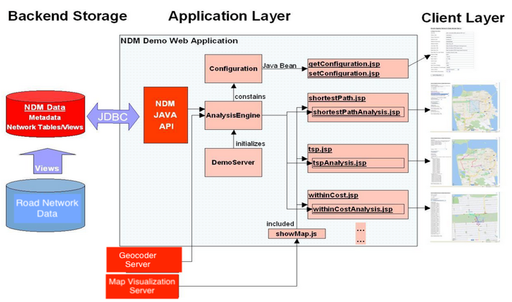

# Introduction

## About Network Data Model

In many applications, capabilities or objects are modeled as nodes and links in a network. The network model contains logical information such as connectivity relationships among nodes and links, directions of links, and costs of nodes and links.

With logical network information, you can analyze a network and answer questions, many of them related to path computing and tracing. For example, for a biochemical pathway, you can find all possible reaction paths between two chemical compounds; or for a road network, you can find the following information:

- What is the shortest (distance) or fastest (travel time) path between two cities?

- What is the closest hotel to a specific airport, and how can I get there?

In addition to logical network information, spatial information such as node locations and link geometries can be associated with the network. This information can help you to model the logical information (such as the cost of a route, because its physical length can be directly computed from its spatial representation).

  

For more information please visit [https://oracle.com/goto/spatial] (https://oracle.com/goto/spatial)

Estimated Workshop Time: 60 minutes

### Workshop Overview

In this workshop you will create and configure a network data model and perform some basic spatial analysis. 

### Prerequisites

- This workshop requires access to an Oracle Database and SQL client (i.e., SQL Developer, SQL Developer Web, SQL*Plus). 
- Before you get started, complete the workshop [Introduction to Oracle Spatial](https://oracle.github.io/learning-library/data-management-library/database/spatial/spatial/workshops/intro-to-spatial/freetier/?lab=introduction).
- No previous experience with Network Data Model is required.

## Acknowledgements

* **Author** - Xiangtai Hou, Spatial, Oracle
* **Last Updated By/Date** - Xiangtai Hou, March 2021

## Need Help?
Please submit feedback or ask for help using our [LiveLabs Support Forum](https://community.oracle.com/tech/developers/categories/oracle-spatial). Please click the **Log In** button and login using your Oracle Account. Click the **Ask A Question** button to the left to start a *New Discussion* or *Ask a Question*.  Please include your workshop name and lab name.  You can also include screenshots and attach files.  Engage directly with the author of the workshop.

If you do not have an Oracle Account, click [here](https://profile.oracle.com/myprofile/account/create-account.jspx) to create one. 
